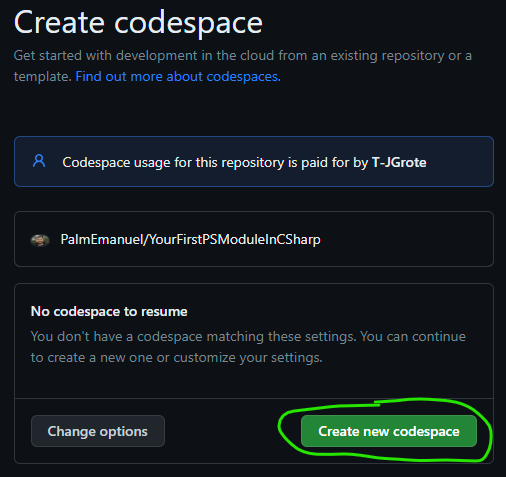
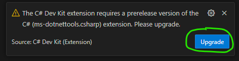

# Your First PowerShell Binary Module

This is a demo of how to develop a PowerShell Binary Module. This repository is the companion to the PSConfEU 2023 Presentation "Creating your first PowerShell module in C#".

## Follow Along Setup

If you run into any problems with this setup feel free to reach out to either @JustinWGrote or @PalmEmanuel on twitter, you can also file an issue in the GitHub repository and we will respond.

### Option 1: Codespaces (Recommended)

[GitHub Codespaces](https://github.com/features/codespaces) provides a complete preconfigured development environment that runs in GitHub. GitHub provides all users 60 hours a month of free usage. You do not even need Visual Studio Code installed locally, it can run within your browser.

1. [Sign up for a GitHub account](https://github.com/join) if you do not already have one. It is free to join.
1. Open our codespaces quickstart link in the browser of your choice (Edge/Chrome recommended)

1. Click `Create new codespace` when prompted. You can optionally click `Change Options` and increase the codespace size to 4 cores to improve your experience, however this will halve the total number of codespaces hours which are available to you for no cost. If this is your first time using codespaces, there is still plenty of time to complete this exercise and we recommend the 4 core experience, the 2 core can be a bit laggy at times for the level of compute intensity we do here.

1. If you have Visual Studio Code installed, it will prompt you to open a link in Visual Studio code to connect to your codespace, otherwise the web version of Visual Studio Code will open in your browser and connect to the codespace.
1. Once the codespace loads, you will likely see a warning about the C# prerelease being required. Go ahead and click Upgrade to reload the codespace. This is due to the new C# Dev Kit extension and this message will stop occuring once it becomes generally available.

1. The codespace may take several minutes to load.
1. **Congratulations!** You are now ready to start your PowerShell Binary Module development journey.

### Option 2: Devcontainer

This is an option if you wish to work "offline". It does not require a GitHub account, though we still recommend a GitHub Account as you will not be able to make pull requests to test the lab exercises without one.

1. Follow the [Dev Containers Tutorial](https://code.visualstudio.com/docs/devcontainers/tutorial) to setup devcontainers on your local computer.
1. Clone the Github Repository (https://github.com/PalmEmanuel/YourFirstPSModuleInCSharp.git) to a local folder and then open it in Visual Studio Code
1. You should be prompted to reopen the project in a devcontainer.
1. Once the codespace loads, you will likely see a warning about the C# prerelease being required. Go ahead and click Upgrade to reload the codespace. This is due to the new C# Dev Kit extension and this message will stop occuring once it becomes generally available.

1. **Congratulations!** You are now ready to start your PowerShell Binary Module development journey.

### Option 3: Local Development

If you prefer local development, or are in a controlled environment without access to Docker or Codespaces, you can simply clone this GitHub repository and work locally. You will need to manually install PowerShell, .NET Core, and all the relevant extensions. **This is not recommended**

## Customizations

### Custom PowerShell Version

This repository by default uses the latest PowerShell version that matches the .NET SDK in the container. For example, the .NET 7 SDK ships with PowerShell 7.3.1.

If you want to test with a specific PowerShell version, open `devcontainer.json`, uncomment the PowerShell feature, and specify the version you want to test with, however it's generally better to download and install the executable separately and run it standalone in tests.

### Custom .NET SDK

Adjust the `devcontainer.json` and change the image version to the SDK you want to develop with. If you not using a devcontainer, you also need to update the `global.json` to specify a minimum. Note that most of the time you always want to be using the latest available, since newer SDKs can target older versions. For example, if you want to make a module to target PowerShell 7.2 (.NET 6), you can do this with the .NET 7 SDK, you don't need to install the .NET 6 SDK.

## Examples of Great C# Modules

- [Pester/src/csharp](https://github.com/pester/Pester/tree/main/src/csharp): The ubiquitous test and mock framework for PowerShell.
- [JustinGrote/Mortar](https://github.com/JustinGrote/Mortar): A templating engine for PowerShell, leveraging the dotnet templating engine.
- [PalmEmanuel/AzBobbyTables](https://github.com/PalmEmanuel/AzBobbyTables): A lightweight PowerShell module for working with Azure Storage Tables.
- [JustinGrote/PowerConfig](https://github.com/JustinGrote/PowerConfig): Configure your Script or Module with an overlaying config engine. Uses Microsoft.Extensions.Confidguration.
- [BicepNet](https://github.com/PSBicep/BicepNet) for [PSBicep](https://github.com/PSBicep/PSBicep): A PowerShell module for the Bicep language, used for deploying Azure resources declaratively.
- [lordmilko/PrtgAPI](https://github.com/lordmilko/PrtgAPI): C#/PowerShell interface for PRTG Network Monitor.
- [PoshAnywhere](https://github.com/justingrote/poshanywhere): An advanced implementation of a PowerShell custom transport. Demonstrates advanced concepts such as a derived PSCmdlet, async operations, and using a BlockingCollection to manage PSCmdlet output
